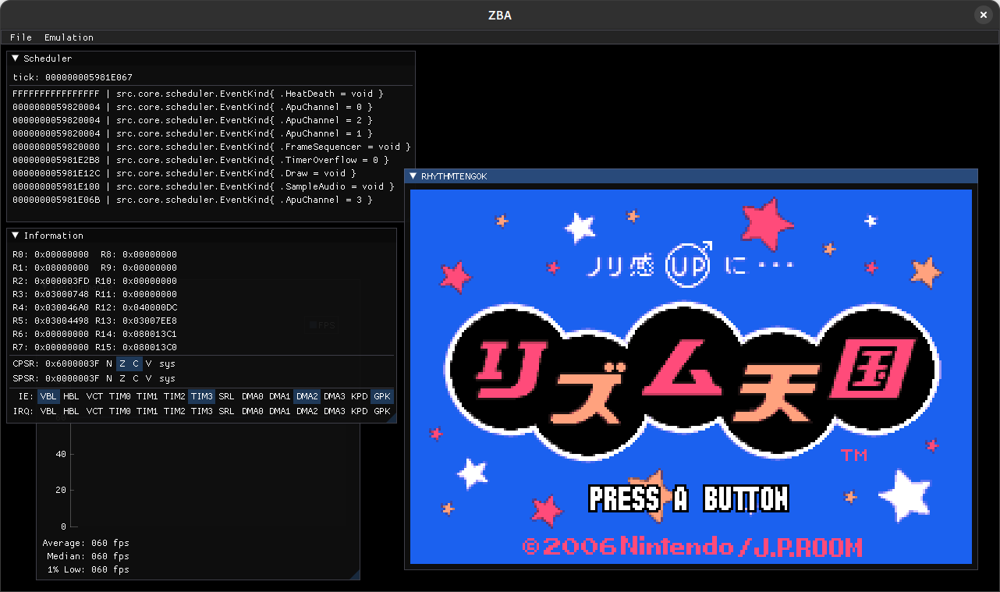

# ZBA (working title)

A Game Boy Advance Emulator written in Zig ⚡!

## Scope

I'm hardly the first to write a Game Boy Advance Emulator nor will I be the last. This project isn't going to compete with the GOATs like [mGBA](https://github.com/mgba-emu) or [NanoBoyAdvance](https://github.com/nba-emu/NanoBoyAdvance). There aren't any interesting ideas either like in [DSHBA](https://github.com/DenSinH/DSHBA).

This is a simple (read: incomplete) for-fun long-term project. I hope to get "mostly there", which to me means that I'm not missing any major hardware features and the set of possible improvements would be in memory timing or in UI/UX. With respect to that goal, here's what's outstanding:

### TODO

- [x] Affine Sprites
- [ ] Windowing (see [this branch](https://git.musuka.dev/paoda/zba/src/branch/window))
- [ ] Audio Resampler (Having issues with SDL2's)
- [ ] Refactoring for easy-ish perf boosts

## Usage

ZBA supports both a CLI and a GUI. If running from the terminal, try using `zba --help` to see what you can do. If you want to use the GUI, feel free to just run `zba` without any arguments.

ZBA does not feature any BIOS HLE, so providing one will be necessary if a ROM makes use of it. Need one? Why not try using the open-source [Cult-Of-GBA BIOS](https://github.com/Cult-of-GBA/BIOS) written by [fleroviux](https://github.com/fleroviux) and [DenSinH](https://github.com/DenSinH)?

Finally it's worth noting that ZBA uses a TOML config file it'll store in your OS's data directory. See `example.toml` to learn about the defaults and what exactly you can mess around with.

## Compiling

Most recently built on Zig [v0.15.1](https://github.com/ziglang/zig/tree/0.15.1)

Run `zig build -Doptimize=ReleaseSafe`. The executable will be under `zig-out/bin` and the shared libraries (if enabled) under `zig-out/lib`. If working with shared libraries on windows, be sure to add all artifacts to the same directory. On Unix, you'll want to make use of `LD_PRELOAD`.

## Controls

Key | Button | | Key | Button
--- | --- | --- | --- | ---
<kbd>A</kbd> | L | | <kbd>S</kbd> | R
<kbd>X</kbd> | A | | <kbd>Z</kbd> | B
<kbd>Return</kbd> | Start | | <kbd>RShift</kbd> | Select
Arrow Keys | D-Pad

## Tests

GBA Tests | [jsmolka](https://github.com/jsmolka/) | gba_tests | [destoer](https://github.com/destoer/)
--- | --- | --- | ---
`arm.gba`,  `thumb.gba` | PASS | `cond_invalid.gba` | PASS
`memory.gba`, `bios.gba` | PASS | `dma_priority.gba` | PASS
`flash64.gba`, `flash128.gba` | PASS | `hello_world.gba` | PASS
`sram.gba` | PASS | `if_ack.gba` | PASS
`none.gba` | PASS | `line_timing.gba` | FAIL
`hello.gba`, `shades.gba`, `stripes.gba` | PASS | `lyc_midline.gba` | FAIL
`nes.gba` | PASS | `window_midframe.gba` | FAIL

GBARoms | [DenSinH](https://github.com/DenSinH/) | GBA Test Collection | [ladystarbreeze](https://github.com/ladystarbreeze)
--- | --- | --- | ---
`eeprom-test`, `flash-test` | PASS | `retAddr.gba` | PASS
`midikey2freq` | PASS | `helloWorld.gba` | PASS
`swi-tests-random` | FAIL | `helloAudio.gba` | PASS

FuzzARM | [DenSinH](https://github.com/DenSinH/) |  arm7wrestler GBA Fixed | [destoer](https://github.com/destoer)
--- | --- | --- | ---
`main.gba` | PASS | `armwrestler-gba-fixed.gba` | PASS

## Resources

- [GBATEK](https://problemkaputt.de/gbatek.htm)
- [TONC](https://coranac.com/tonc/text/toc.htm)
- [ARM Architecture Reference Manual](https://www.intel.com/content/dam/www/programmable/us/en/pdfs/literature/third-party/ddi0100e_arm_arm.pdf)
- [ARM7TDMI Data Sheet](https://www.dca.fee.unicamp.br/cursos/EA871/references/ARM/ARM7TDMIDataSheet.pdf)
